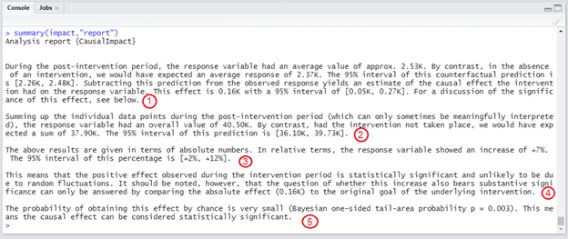

```{r load, include=FALSE}
knitr::opts_chunk$set(echo = TRUE)
library(knitr)
read_chunk('../MainDocument/SCRIPTS/000-libraries.R')

```

```{r libraries, include = FALSE}
```


```{r , include=FALSE}
deaths_pr <- readxl::read_xlsx("../MainDocument/Deaths0918.xlsx", sheet=1)
```

# Introduction

The identification of causal effects (referred to as causal inference) is a powerful motivation for social scientists [@pearl2009causality]. Often, the identification of a causal mechanism relies on comparisons to counterfactual control groups -- the treatment group compared to a control group – and the difference between the two groups identifies the causal effect. “Real world data” rarely neatly bifurcate into treatment and control groups, especially with longitudinal time series data, but the creation of “synthetic” counterfactual control groups in possible with both inductive and abductive scientific approaches. Inductive analysis leverages knowledge of an intervention to produce a synthetic control group and thus a causal effect while abductive analysis identifies the potential effect via outlier analysis and produces a counterfactual control group to measure the size of the causal effect. This software review focuses on detecting and measuring intervention effects and evaluates two approaches available for conducting this analysis within the R software framework [@rcore].

Given the emergence and growing availability of intensive longitudinal data (IDL), ecological momentary assessments (EMA), and other sources of information such as social media activity or phone use, there is increasing need to analyze time series, and isolate effects within the phenomenon of interest (McNeish et al. 2021; Ram et al. 2020). 
<!-- FIX THESE CITATIONS -->
This paper provides an overview of two packages in R that offer specific functions to detect and measure intervention effects using both inductive and abductive approaches: \textsf{CausalImpact} [@brodersen2015inferring] and \textsf{tsoutlier} packages [@tsoutliers]. In the following software review, we first describe the illustrative data used in this paper, then provide sample code and explore some of the options available within both packages. We conclude this software review by comparing and discussing the results derived from both functions. 

# Illustrative Data
We will use monthly death counts from the Puerto Rico Vital Statistics System to illustrate the functionality of the tsoutliers and \textsf{CausalImpact} and \textsf{tsoutliers} packages. The data contain monthly aggregates of deaths for Puerto Rico between 2010 and 2018. These data have been used in previous ...

# R Packages for Detection and Measuring Intervetions

## CausalImpact() in the CausalImpact package

The \textsf{CausalImpact} package developed by Kay H. Brodersen and Alain Hauser implements a Bayesian approach to the estimation of causal impact in time series and utilizes a classic, inductive approach to measuring causal intervention  effects [@brodersen2015inferring]. It computes a causal impact as well as its duration using a pre- and post-intervention approach. \textsf{CausalImpact} assumes that a time series can be explained by a set of covariates which are not affected by the intervention being measured. We use the previously introduced dataset to demonstrate three of the multiple ways this package can be used. First, we rely on an autoregressive model that uses the time series past information to forecast a potential counterfactual. Second, we rely on the autoregressive model but controlling for population size. Third, we rely on the death counts from a state that was not affected by Hurricane María to produce the counterfactual model. 

Usage of \textsf{CausalImpact()} is shown below with all arguments set to the default:

```{r , echo = T, eval = FALSE}
CausalImpact(data = NULL, pre.period = NULL, post.period = NULL, 
             model.args = NULL,  bsts.model = NULL, 
             post.period.response = NULL, alpha = 0.05)
```

A simple analysis using this function will require information in the `data`, `pre.period`, and `post.period` arguments. First, the `data` argument is the time series for which we want to measure the intervention. The `pre.period` argument is the period preceding the intervention, in this case the month in which the Hurricane occurred. The `post.period` argument defines the post-intervention window that defines the number of observations to be considered after the intervention. Thus, some simple data processing is required to conduct the analysis using `CausalImpact()`. We produce a time series with the monthly death counts and need to specify the pre- and post-intervention periods. This is accomplished with the following code: 

```{r , echo = T, eval = TRUE, attr.source='.numberLines'}
deathspr <- deaths_pr$Deaths
pop <- log2(deaths_pr$Population_Estimate)
data <- cbind(deathspr) 
data2 <- cbind(deathspr, pop)
pre.period <- c(1, 90)
post.period <- c(91, 106)

```

The first and second line create a time series for the monthly deaths and corresponding population estimates. The third lines create a univariate time series object of just the deaths and the fourth line creates a multivariate time series of both the deaths and population estimates. both time series. The fifth and sixth lines are numeric values defining the pre- and post-intervention period; these values are required to perform the most basic analysis using `CausalImpact()`. How are the pre- and post-intervention period defined? It comes from our understanding of the data and determining when the intervention occurred. In our case, the data contains observations for every month between **2000 and 20XX**. In this data arrangement September 2017 is the 91st observation. Thus, the pre-intervention period is the period between observation 1 and 90, and the post-intervention period is anything after that period (91-onward). This is all the data manipulation and specifications we require to conduct a simple `CausalImpact` analysis. The following code illustrate the way to estimate the basic model and the numerous ways we can explore the results:

```{r , echo=T, eval=FALSE, attr.source = '.numberLines', results='hide'}

impact <- CausalImpact(data, pre.period, post.period)
impact2 <- CausalImpact(data2, pre.period, post.period)

impact
summary(impact, "report")
plot(impact)

```

```{r , echo=T, eval=TRUE, results='hide'}

impact <- CausalImpact(data, pre.period, post.period)
impact2 <- CausalImpact(data2, pre.period, post.period)

```

The above code stores the output from `CausalImpact()` in an object called `impact` for the model that does not consider population size and `impact2` for the one with controls for population size. The function includes the three main arguments described above. The results can be explored in three ways: (1) by examining the raw output, (2) by asking R to produce a brief report, and (3) by producing a visualization of the intervention effect. The second line in the previous chunk of code provides the Actual and Predicted averages and cumulative counts, and describes the absolute and relative effect of the intervention. These pieces of information are accompanied by their corresponding measures of error and 95% intervals. 

<!-- # ```{r , echo=F, eval=TRUE, fig.cap=paste("Estimated reduction in life expectancy at birth ($e_0$) by the 2080s under the $MID$ scenario.\\label{map}")} -->
<!-- # impact -->
<!-- # ``` -->

By using the `summary(impact, "report")` function, we request a narrative summary of the analysis. Note, that simply asking for a summary without specifying the report section will yield the same results as the second line (ie using `summary(impact)`). In **\autoref{report}** we present the full text that comes from report which is a comprehensive analysis of the intervening being analyzed. The report is divided in five subsections. Section 1 describes what happened during the post-intervention period and present a brief overview of the causal effect. Section 2 aggregates the data from the post-intervention period and provides a brief overview of what occurred and what would have occurred absent the intervention. Section 3 transforms the results described in Section 2 into relative terms, in this case the percent increase observed in the death counts and the corresponding 95% interval. Section 4 summarizes the effect of the intervention, indicates whether there is a significant effect and asks the researcher to compare the absolute effect with the goal of the intervention. Section 5 described the probability that the effect happened at random with a corresponding p-value. The concluding sentence asserts whether the causal effect can be considered statistically significant. The results presented in this report indicate that Hurricane María constituted a significant intervention regarding the number of deaths and that it is highly unlikely that this occurred by chance. The fifth line of code produces the `CausalImpact` analysis incorporating population size as a covariate.


```{r , echo=F, eval=TRUE, out.width='100%', fig.cap=paste("\\textbf{CausalImpact narrative report resulting from the assessment of mortality following Hurricane María.}\\label{report}")}

```

```{r , echo=T, eval=F, attr.source = '.numberLines', fig.cap=paste("\\textbf{Visualization of CausalImpact results without and with controls for population size as univariate and multivariate time series.} \\label{plots}")}

impact.plot <-  plot(impact) +  
  theme_bw(base_size = 12) +
  labs(title = "Without Population Controls (univariate)", 
       x ="Time", 
       y = "Deaths")

impact.plot2 <- plot(impact2) +  
  theme_bw(base_size = 12) +
  labs(title = "With Population Controls (multivariate)", 
       x = "Time", 
       y = "Deaths")

ggpubr::ggarrange(impact.plot, 
                  impact.plot2, 
                  ncol=1, 
                  nrow=2) #Combines both graphs 

```

The third and final way we can assess the effect of the intervention is by visually examining the time series, the effect estimates, and the cumulative effect. The `CausalImpact` package is compatible with the basic plot functions included in R. The fourth line in the previous code uses `plot()` in combination with the impact object to produce a plot with three panels. These panels include: (1) the original time series (black line) with the expected time series in light blue, (2) the effect estimates for the post-intervention period, and (3) the cumulative effect. The timing of the intervention is represented by a dashed-vertical line in each of the panels. Both the pointwise and cumulative estimates are accompanied by corresponding 95% intervals. The visualization indicates that mortality on and after September 2017 exceeded the expected range and that this effect was sustained for a couple of months after Hurricane María. In Figure 3, we present the resulting plots for both impact analyses described above. We combined the basic plot function with functions from the `ggplot2` and `ggpubr` packages. These figures were produced using the following code: 


```{r , echo=F, eval=T, attr.source = '.numberLines', fig.cap=paste("\\textbf{Visualization of CausalImpact results without and with controls for population size as univariate and multivariate time series.} \\label{plots}")}

impact.plot <-  plot(impact) +  
  theme_bw(base_size = 12) +
  labs(title="Without Population Controls (univariate)", 
       x ="Time", 
       y = "Deaths")

impact.plot2 <- plot(impact2)
impact.plot2 <-  plot(impact2) +  
  theme_bw(base_size = 12) +
  labs(title="With Population Controls (multivariate)", 
       x ="Time", 
       y = "Deaths")

ggpubr::ggarrange(impact.plot, impact.plot2, ncol=1, nrow=2) #Combines both graphs 

```


## `tso()` in the `tsoutliers` package

The `tsoutliers` package [@tsoutliers] implements a mathematical approach for the automatic detection of outliers in both univariate and multivariate time series originally formulated by Chen and Liu in 1993 [@chen1993joint]. In contrast to the `CausalImpact` package which uses an inductive approach to estimating the magnitude of a causal effect, the `tsoutliers` package uses an abductive approach for both finding and estimating causal effects. `CausalImpact` requires ex-post knowledge of an intervention to measure the magnitude of the effect. `tsoutliers`, by virtue of its abductive approach, does not require ex-post knowledge as the algorithm searches the time series for anomalous behavior and the cause of the effect is reasoned ex-post.

Time series are affected by exogenous factors and the effects are felt differently across the phenomenon of our interest. Aside from detecting outliers within out time series, the `tso()` function offers insights about the effect being captured when an outlier is detected. By default, three types of outliers detected are: 

1. Additive outliers (AO) -  isolated large or small values within the time series, 
2. Level shifts (LS) -  a change in the average levels with the observations following the outlier shifting accordingly. This change may be due to seasonality, but has the distinctive feature of the change being permanent, and 
3. Temporary or transient changes (TC) - similar to LS but the effect of the outlier reduces over subsequent observations. Eventually, the values return to the levels observed prior to the outlier.  

The two additional outliers featured in this package are:
4. Innovative outliers (IO) -  outliers that derive from innovation in the data generating process that affects all subsequent observations, and 
5. Seasonal level shifts (SLS) - similar to LS but they occur at some point and reoccur every year (time window) at the same season and its effect affects the subsequent seasons. 

The `tso()` function  iteratively uses ARIMA models to 1) identify potential outliers or anomalies and 2) refit the ARIMA with the outliers removed to produce a counter-factual time series. A detailed discussion of these outliers and the detection algorithm is available in extant literature [@chen1993joint; @tsoutliers; @asghar2017analysis; @burman1988outliers].

Usage of `tso()` is shown below with all arguments set to the default:

```{r , echo = T, eval = FALSE}
tso(y, xreg = NULL, cval = NULL, delta = 0.7, types = c("AO", "LS", "TC"), 
    maxit = 1, maxit.iloop = 4, maxit.oloop = 4, cval.reduce = 0.14286,    
    discard.method = c("en-masse", "bottom-up"), discard.cval = NULL, 
    remove.method, remove.cval, tsmethod = c("auto.arima", "arima"),   
    args.tsmethod = NULL, logfile = NULL, check.rank = FALSE)
```

Most of the default arguments pertain to the creation of the arima models and will work well for most exploration of outliers. Here, we use the `y`, `types`, and `xreg` arguments to determine whether the number of deaths following Hurricane María is considered an outlier, and if so, the type and magnitude of the outlier. In addition, we explore whether the results change when we control for population size. First, the `y` argument is the time series of interest and must be a time series object. Rarely, R will import time series data as a time series object, rather than a dataframe, so most analyses require simple data processing convert the data into a format that compatible with `tso()`. For analyzing a multivariate time series using the `xreg` argument, the dataformat is slightly different and must be in the form of a matrix or array. After importing the data, we transform the information into a time series using the `ts()` function available through the `stats` library, as follows: 

```{r , echo = T, eval = TRUE, attr.source='.numberLines'}

Deaths_ts <- stats::ts(deaths_pr$Deaths, frequency=1) 
Popula_ts <- deaths_pr$Population_Estimate


```

The first line creates a time series for the monthly deaths from 2010 until 2018 and the second one creates a time series object for the corresponding monthly population estimates. This information was contained within the dataset we imported in the illustrative data section (see Table 1). This is all the data manipulation required to have the data in a format that is familiar to the `tso()` function. 

The essential arguments for `tso()` are the time series of interest for detecting outliers, the type of outliers to detect, and potentially a control variable or variables (`xreg`). We start with a simple model that only considers the monthly death counts (`y`), specifying the detection for the three default types of outliers: AO, LS, and TC. The models are estimated using the following code: 

```{r , echo = T, eval = TRUE, attr.source='.numberLines'}
analysis <- tso(Deaths_ts, types=c("AO","LS","TC"))

analysis2 <- tso(y=Deaths_ts, xreg = Popula_ts, types=c("AO","LS","TC"))


```

The above code stores the output from `tso()` in two separate objects called `analysis` for the univariate time series and `analysis2` for the multivariate. The difference between both analyses is the inclusion of population estimates to account for changes in population size. We access the results by: (1) looking at the output in table form (**\autoref{tso-table}**) or (2) through data visualization (Figure 1). To examine the output table one must simply write the name of the object where the results are stored in the console. The output includes the type of outlier detected, the observation id, the estimated excess and the t-statistic associated with the outlier. 

```{r  , echo = F}


df<- analysis$outliers
df$Analysis = "Univariate"
df2 <- analysis2$outliers
df2$Analysis = "Multivariate (population size)"

df <- rbind(df, df2) %>%
  dplyr::select(Analysis, type:tstat)

kable(df,
      longtable = T,
      booktabs = T,
      escape = FALSE,
      caption = "\\textbf{Outlier detection for monthly deaths for Puerto Rico, 2010-2018 without (univariate) and with (multivariate) controls for population size.} \\label{tso-table}")
```


In both instances, the model identified September 2017 (time indexed value 91) as a temporary change (TC) outlier. This tells us that the number of deaths detected in the month of Hurricane Maria exceeded the expected levels and that this effect was not constrained to that month, it continued affecting Puerto Rico for subsequent months until the point the number of deaths returned to expected levels. In this case, `coefhat` represents the excess deaths observed in this month. The univariate model indicates that there were 597 deaths in excess of historical patterns in that month and the multivariate analysis accounting for population size indicates that 682 deaths occurred in excess of expected levels.

This outlier was classified as a TC type of outlier; this means the effect of the hurricane is lingered for some subsequent periods. To better understand the impact of the Hurricane and its diminishing effects, it is best to visualize the outlier in comparison to the time series and how this observation, and subsequent ones, deviate from the expected pattern. The tsoutlier package is compatible with the basic plotting functions. To produce a visual representation of the time series and the outlier effects we use `plot()`. For purposes of brevity, we show the visualization of the multivariate model that controls for population size. 

We simply ask R to plot the object where the output is stored: 

```{r , echo=T , fig.cap=paste("\\textbf{Plot of the tso function that considers population size through the xreg argument.} Detecting one outlier in September 2017 (red dot) with a diminishing effect in the following months until the time series converges towards the expected levels based on pre-Hurricane María patterns represented in the outlier effects panel.} \\label{tso-plot}") }
plot(analysis2)
```

## Comparison of the `tsoutlier` and `CauslImpact` packages

Previous studies that employ a time series approach to estimate excess deaths in Puerto Rico have estimated the excess deaths in September 2017 to be: 574 (95% C.I. 515-630), 449 (95% C.I. 377-527), and 459 (95% C.I. 425-293) [@rivera_estimating_2018; @santos2018differential; @santos2018use]. Cumulative estimates of excess death range from XX to XXX [CITES]. The results derived from both the `CausalImpact` and `tsoutliers` packages are consistent or close to these estimates. Furthermore, without programming in September 2017 as the date of the hurricane, the `tso` function correctly identifies September 2017 as an outlier when compared to the expected counts. 

While the results of both functions are similar to eachother and to published results, the process and formulation of the approach differ. As stated above, the packages utilize different logical approaches to identifying and estimating causal effects. `CausalImpact` uses a more classical, inductive approach to identify effects and if one knows the date of an intervention, the `CausalImpact` package might be a reasonable choice. However, sometimes the date of an intervention is unknown. Take for instance the COVID-19 pandemic, is the onset of the pandemic is not knowable for all states or countries. If one were to try and identify the excess mortality of the pandemic, the `tsoutliers` package might be a more reasonable choice. Both functions have some form of significance teesting. `tso()` provides a t-statistic that corresponds to the detected outlier while the `CausalImpact` function provides a p-value corresponding to a Bayesian-one sided tail area probability. Finally, both functions provided a way of visually examining the time series and the resulting analysis. Both methods allow us to conclude that the Hurricane María caused deaths in excess of expected levels as established in the extant literature [@sandberg2019all]. 

# Discussion

There is a growing interest and need to assess the causal effects of interventions [@pearl2009causality] and the `tsoutliers` and `CausalImpact` packages provide avenues to identify causal effects for time series data. 

Due to the different logical approaches to estimating causality, the packages both similar and different data requirements. Both packages require a time series for which detection and measurement of a causal effect are desired and both packages are compatible with univariate and multivariate time series. For `tso()` multivariate times series are included by specifying the `xreg` argument. To incorporate controls within the `CausalImpact` approach, they need to be included them in the data matrix. This matrix should be structured in a way that the first column corresponds to the time series of interest, and the subsequent columns are the controls. Despite slight differences in both mathematical formulation and empirical approach, both methods produce similar results. Only the `CausalImpact` approach requires additional information about the timing of an intervention, the `tsoutliers` package searches for the intervention.  This is a direct result of the objective of each function, while `tsoutliers` is a more powerful detection tool and `CausalImpact` might be better suited to measure an intervention effect when knowledge of the specific timing of an intervention is available. 

The `tso()` function does not calculae the cumulative effect of a detected outlier but this can be remedied by with basic arithmetic. To measure the cumulative effect, we subtract the expected values from the observed ones after the outlier is detected. The summation of these differences is the cumulative effect of the intervention. While simple in coding, researchers need to be careful not to include effects that correspond to another outlier into the total. In our illustrative example, only one outlier was detected so this is not an issue. However, the situation becomes more complex when multiple outliers are detected and for instances where these outliers may have an effect in subsequent periods or when we observe a shift in the time series. Thus, estimating cumulative effects is a process that should be performed with caution and after a careful examination of the results. 

Visualizations with both packages are easy to produce and interpret. These are produced using the `plot()` function which is part of the original or base graphics functions included with R. When plotting the results from `tso()`, a two-panel graph is produced where the upper panel presents the time series and highlights any outliers detected. The lower panel provides insights as to how far the outlier is from the expected value and for how long this effect lasts. How long did the effect last? The `tso()` can detect isolated points, concentrated effects, or significant shifts in the time series. Thus, it provides a simple, yet elegant visualization that allows following the effect across time. In the case of the `CausalImpact()` visualization, the plot function produces three panels, modifiable with code. The first panel, labeled original, is similar to the upper panel produced with tso() and it shows the time series and the expected values. The second panel is similar to the lower panel produced with `tso()` and it shows the effect estimates for each post-intervention observation. The third panel is unique to `CausalImpact()` and consists of the cumulative effect of the intervention. The key distinction between both visualizations is that `CausalImpact()` includes a dashed-vertical line representing the start of the post-intervention period. In our code, we also provide examples that combine the initial plots with functions from the `ggplot2` and `ggpubr` packages to put titles and axes titles in both figures, and to join them into one data visualization. Although this last comment deals with the aesthetics of visualization, and not with the results, we highlight the possibility of modifying the visualization, which can be useful when researchers are interested in producing publication-ready figures. 

In closing, both packages are similar in that they produce consistent estimates of excess mortality following the intervention. However, they offer different insights into the intervention that users should be aware of. The `tsoutliers` package is better suited for analyses where we are interested in detecting and understanding intervention effects within a time series. On the other hand, the `CausalImpact` package is better suited for analyses where the timing of the intervention is known. While other approaches exist, we see a fruitful and promising avenue for the use of both functions to detect and measure intervention effects when time series are available. Both packages have their strengths and weaknesses, but they can be used to perform both inductive and abductive assessments of interventions.  

